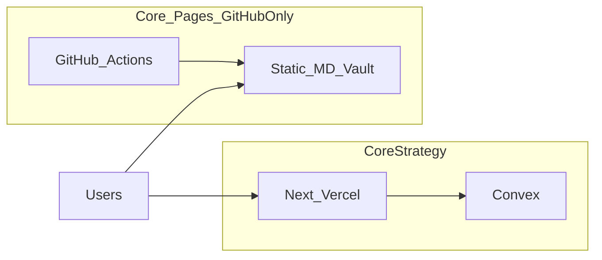

# Vault (public MDX) — Core-Pages only

**Read when:** syncing MDX content, community rules, or explaining trust boundaries.

**Where it runs:** Built and deployed **only** from this repo ([Core-Pages](https://github.com/bengueta/Core-Pages)) on GitHub Pages: [bengueta.github.io/Core-Pages/vault/](https://bengueta.github.io/Core-Pages/vault/). **Not** Vercel and **not** the CoreStrategy Next.js app.

## Trust boundaries (non-negotiable)

| Rule | Detail |
|------|--------|
| **No Convex** | Public MDX Vault must never call Convex or use `@convex-app/*` |
| **No CoreStrategy production secrets** | No Doppler / Vercel / Convex keys in the Core-Pages vault build |
| **No CoreStrategy APIs** | Static files only; no `corestrategy` backend |
| **No shared session** | Public GH Pages site ≠ authenticated CoreStrategy product |
| **GitHub contribution path** | PRs + optional Discussions / Giscus — no write tokens in the browser bundle |

## Layout in this repo

- [`vault/`](../vault/) — Astro + MDX site, forum, and Studio builder.
- CI: `.github/workflows/deploy-pages.yml` and `process-pages.yml`.
- Integration guide: [vault/INTEGRATE_CORE_PAGES.md](../vault/INTEGRATE_CORE_PAGES.md).

**Public URL:** [https://bengueta.github.io/Core-Pages/vault/](https://bengueta.github.io/Core-Pages/vault/)

CoreStrategy links here via `TOOL_ROUTES.vault` only — no vault code in that repo.

## Rollout / operations

Operational steps: [VAULT_ROLLOUT.md](./VAULT_ROLLOUT.md).

## Related docs

- [VAULT_ISOLATION_CHECKLIST.md](./VAULT_ISOLATION_CHECKLIST.md)
- [VAULT_ROLLOUT.md](./VAULT_ROLLOUT.md)
- [vault/README.md](../vault/README.md)
